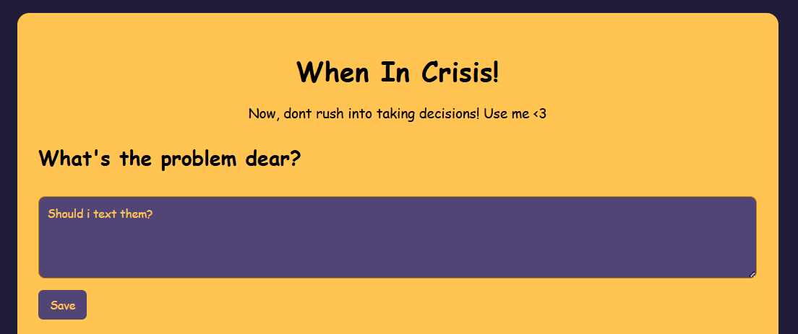
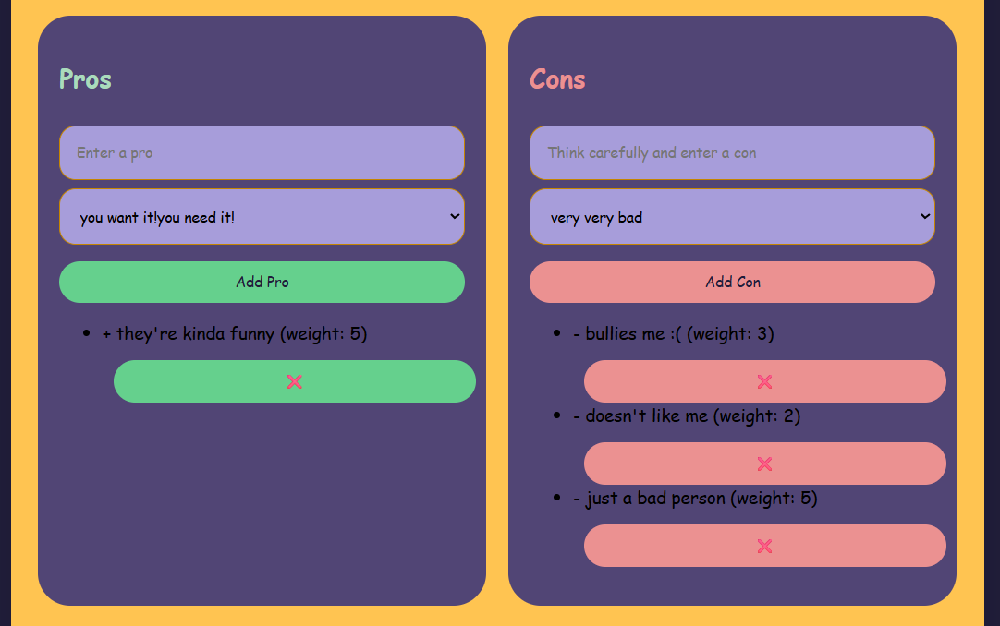
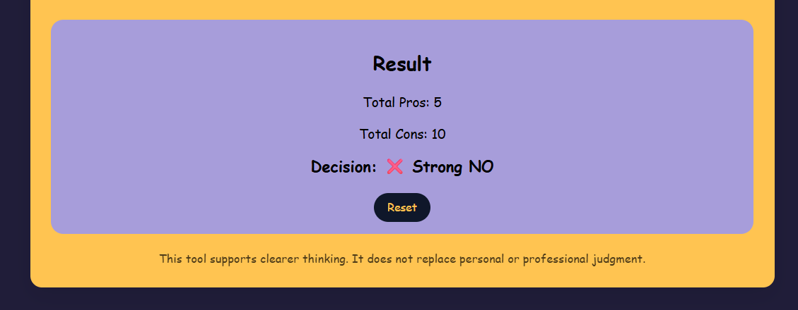

# When in crisis...
## I usually call my mom. But somethimes even mom can't help.

So i made this!

### Because flipping a coin deserves an upgrade.

Ever stared at the ceiling at 2AM thinking:
“Should I do this… or not?”

This little web app exists for exactly that moment.

This Tool helps you dump your thoughts out of your head, turn them into pros and cons, give them weights.

It won’t make the decision for you.
But it will make your thoughts stop screaming.

### 🔗 Live demo: https://when-in-crisis.netlify.app/

## Built with

1.HTML
2.CSS 
3.JavaScript 
4.localStorage 
5.Netlify 
6.Gemini AI 

## Why I made this

I’m interested in building tools that help people think clearly, especially in stressful or confusing situations.
This is a small prototype of a bigger idea I have.

Also… I overthink. So I built something about it.

# How to Run This Project Locally

You don’t need to install anything special to run this project.

1. Download or clone this repository

2. Open the project folder

3. Double-click index.html

The app will open in your browser.

#Screenshots

